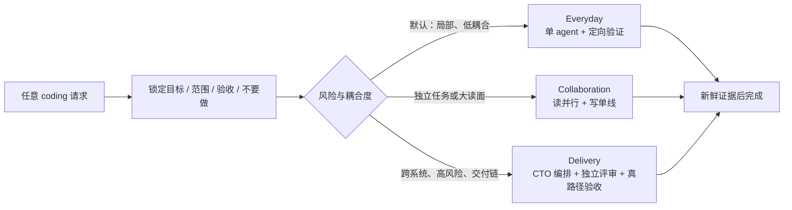

<div align="center">

# JensenMo HappyCoding Everyday

**One automatic coding entrance. Right-sized rigor.**

一个会自己判断轻重的 Codex 编码入口：日常任务轻量执行，需要时才自动升级为多 agent 协作或完整交付编排。

[](#project-status)
[](skills/jensenmo-happy-coding-everyday/SKILL.md)
[](https://github.com/caredhieacid/jensenmo-happy_coding_everyday/actions/workflows/validate.yml)
[](LICENSE)

</div>

## 为什么做这个项目

优秀的 coding agent 流程往往各有所长，但同时安装多个“总入口”后，容易出现重复规划、重复评审、上下文压力和不必要的仪式感。HappyCoding Everyday 把这些长处收进一个自动路由器：用户只说要做什么，流程自己判断需要多少严谨度。

它的目标不是少做验证，而是把验证放在正确的位置；不是到处派 agent，而是在独立工作真的能并行时才协作。



## 三条自动执行通道

| 通道 | 自动触发 | 默认行为 |
| --- | --- | --- |
| **Everyday** | 绝大多数日常编码任务 | 单 agent、最小改动、定向测试，不建额外流程资产 |
| **Collaboration** | 2 个以上独立任务、大范围只读调查、需要独立 review | 少量子 agent，读并行、共享代码写单线 |
| **Delivery** | 跨系统、迁移、安全、生产、长链路、正式 PR/E2E | 目标合同、阶段门禁、异构评审、真路径验收 |

你不需要说“进入 CTO 模式”“用多 agent”或“记得测试”。路由、验证与是否升级由入口负责；只有会改变结果的选择或不可逆操作才会向你确认。

## 核心原则

- **单一入口**：只有这个 skill 决定整体 coding 流程；Git、后端、可观测性等仍是按需加载的领域标准。
- **轻量默认**：没有升级证据时，一律从 Everyday 开始。
- **读并行，写单线**：保护主上下文，也避免多 agent 同时改共享文件造成返工。
- **先证据，后修复**：bug 先复现和找根因；同一路径连续失败两次就停下重判。
- **测试与风险成比例**：小任务跑最小证明，高风险交付走真实路径；完成前都要有最终改动后的新鲜证据。
- **外科手术式改动**：不顺手重构，不发散，不为未来猜需求。

## 安装

```bash
git clone https://github.com/caredhieacid/jensenmo-happy_coding_everyday.git
mkdir -p ~/.codex/skills
ln -s "$(pwd)/jensenmo-happy_coding_everyday/skills/jensenmo-happy-coding-everyday" \
  ~/.codex/skills/jensenmo-happy-coding-everyday
```

为保持“唯一入口”，请停用其他会自动接管整个 coding 生命周期的 dispatcher。领域型 skill 可以保留，并由 HappyCoding Everyday 在需要时调用。更完整的迁移说明见 [架构文档](docs/architecture.md)。

安装后的日常用法没有新口令：照常描述 coding 任务即可。也可以显式调用：

```text
$jensenmo-happy-coding-everyday 修复这个登录问题，完成后给我验证证据。
```

## 仓库结构

```text
skills/jensenmo-happy-coding-everyday/
├── SKILL.md                         # 高频加载的唯一入口与核心约束
├── agents/openai.yaml               # Codex 展示与自动触发配置
└── references/
    ├── lanes.md                     # 三条通道的升级/降级规则
    └── contracts-and-evidence.md    # 派工合同、验证阶梯与证据规则
docs/
├── architecture.md                  # 设计边界与迁移策略
├── implementation-plan.md           # 首版实现计划
└── pressure-tests.md                # RED/GREEN 行为压力测试记录
tests/
├── scenarios.md                     # 可复用场景
└── test_structure.py                # 零依赖结构门禁
```

## 灵感来源

本项目是原创的轻量路由与整合实现，吸收并重新组合了以下项目/方法中的优秀思想：

- [Superpowers](https://github.com/obra/superpowers)：系统化调试、测试优先、新鲜验证、工作树和 review 思想；
- [Evolab](https://github.com/martin1847/evolab)：A² 编排、主上下文保护、契约派工与异构验证；
- [Kucai Agentic Orchestration](https://github.com/Colin131/kucai-agentic-orchestration)：PM 自动接管、开发/评审/QA 角色分离和证据门禁。

HappyCoding Everyday 不复制这些项目的工作流文本，也不要求它们作为运行依赖。感谢这些开源探索提供的启发。

## Project status

当前为 **Alpha**：核心路由、结构测试和行为压力测试已建立，接下来会通过真实 coding 任务持续校准升级阈值，重点观察上下文消耗、返工率和过度编排率。

欢迎提交场景、问题和改进建议。修改行为规则前，请先阅读 [CONTRIBUTING.md](CONTRIBUTING.md)。

## License

[MIT](LICENSE) © 2026 Jensen Mo
