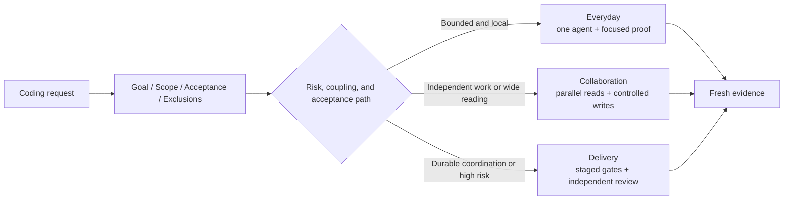

<div align="center">

# ⚡ HappyCoding Everyday

### The risk-aware coding workflow for Codex.

One request in. HappyCoding chooses how much process the work actually needs—from a surgical fix,
to bounded collaboration, to evidence-gated delivery—and closes with fresh proof.

**🌐 Language / 语言 / 言語 / 언어 / Idioma**

[English](README.md) · [简体中文](README.zh-CN.md) · [日本語](README.ja.md) · [한국어](README.ko.md) · [Español](README.es.md)

[](#project-status)
[](https://github.com/caredhieacid/jensenmo-happy_coding_everyday/actions/workflows/validate.yml)
[](skills/jensenmo-happy-coding-everyday/SKILL.md)
[](.codex-plugin/plugin.json)
[](LICENSE)

[30-second overview](#happycoding-in-30-seconds) · [Quick start](#quick-start) · [How it works](#how-it-works) · [Design philosophy](docs/design-philosophy.md) · [Contributing](CONTRIBUTING.md)

</div>

## HappyCoding in 30 seconds

| You provide | HappyCoding handles | You receive |
| --- | --- | --- |
| The outcome, constraints, and anything that must not change | Workflow selection, bounded execution, escalation, and the right level of verification | The requested result, fresh evidence, unverified gaps, and residual risk |

**The promise:** tiny fixes stay tiny; risky delivery earns stronger gates; the user does not become
the workflow engine.

## What is HappyCoding?

HappyCoding Everyday is a single automatic coding-workflow entrance for Codex. It turns a normal
request into a compact contract, selects the lowest sufficient execution lane, performs the work,
and closes with fresh evidence. You do not need to choose a mode, request tests, or manage a team of
agents yourself.

The project optimizes for two things at once:

- **low ceremony for everyday work**;
- **stronger gates when failure becomes expensive**.

## Quick start

### Install as a Codex plugin

```bash
codex plugin marketplace add caredhieacid/jensenmo-happy_coding_everyday
```

Open **Plugins** in Codex, choose **JensenMo HappyCoding**, and install **HappyCoding Everyday**.
Start a new task, then describe the work normally:

```text
Fix the login regression, preserve my unrelated changes, and show me the fresh verification.
```

Use the same entry point for different levels of work:

```text
Audit this API contract. Stay read-only and cite the exact producer and consumer paths.
```

```text
Ship tenant isolation across storage, authorization, UI, and rollout. Preserve a rollback path.
```

Explicit invocation is also available when you want it:

```text
$jensenmo-happy-coding-everyday audit this API contract before changing code.
```

See [Getting started](docs/getting-started.md) for direct skill installation, updating,
uninstalling, and compatibility notes.

## Why this exists

Powerful coding workflows often specialize in planning, TDD, review, orchestration, or delivery.
Installing several of them as competing top-level dispatchers can produce duplicate plans, repeated
reviews, context pressure, and process that costs more than the task.

HappyCoding keeps one dispatcher and composes specialized standards only when the work calls for
them. Git, backend, security, observability, browser, and product-specific rules remain valuable;
they simply do not compete to own the whole lifecycle.

## How it works



| Lane | Use it when | Default behavior | Example |
| --- | --- | --- | --- |
| **Everyday** | One bounded outcome, low coupling, one acceptance path | Inspect, make the smallest change, run focused proof | Fix a parser regression and open a routine PR |
| **Collaboration** | Work can be partitioned independently or a wide read would crowd the main context | Parallelize bounded research; keep shared writes on one line | Investigate an unrelated login 401 and CSV ordering defect |
| **Delivery** | Security, migration, production, durable coordination, or staged real-path acceptance makes failure expensive | Persist the contract, gate stages, review independently, preserve rollback | Ship tenant isolation across storage, authorization, UI, and rollout |

Escalation is reversible. A broad investigation can return to Everyday after evidence proves the
cause is local. A pull request or multiple files do not force Delivery by themselves.

## Design principles

1. **Intent once** — infer the workflow from the request instead of asking the user to select a mode.
2. **Lowest sufficient rigor** — start Everyday and upgrade only on concrete evidence.
3. **Evidence over ceremony** — verification must prove the requested behavior, not merely that a command ran.
4. **Parallel reading, controlled writing** — protect context without creating merge chaos.
5. **Fresh verification** — re-run the relevant proof after the final change.
6. **Reversible escalation** — add durable process only while the task needs it.
7. **Repository rules remain authoritative** — local conventions and stricter safety boundaries still apply.
8. **Read-only means read-only** — an audit, explanation, or diagnosis is not implied permission to edit.
9. **Looking is free** — web search, documentation, a browser, or computer use are normal moves in every lane; process weight gates writes and risk, not observation.

Read the full [design philosophy](docs/design-philosophy.md) and [architecture decision](docs/architecture.md).

## What it deliberately does not do

- It is not a new agent runtime or framework.
- It does not force multi-agent execution.
- It does not require a plan document, full TDD loop, or full test suite for every tiny change.
- It does not replace domain-specific engineering standards.
- It does not interpret autonomous work as authorization for deployment, deletion, migration, or force push.
- It does not count agents, documents, or tool calls as success metrics.

## Installation options

### Option A — plugin marketplace

Recommended for public distribution and the Codex plugin experience:

```bash
codex plugin marketplace add caredhieacid/jensenmo-happy_coding_everyday
```

### Option B — direct user skill

Recommended for local authoring and transparent updates:

```bash
git clone https://github.com/caredhieacid/jensenmo-happy_coding_everyday.git
cd jensenmo-happy_coding_everyday
mkdir -p "$HOME/.agents/skills"
ln -s "$(pwd)/skills/jensenmo-happy-coding-everyday" \
  "$HOME/.agents/skills/jensenmo-happy-coding-everyday"
```

Codex supports symlinked skills. If the destination already exists, inspect it before replacing or
removing anything. Older `~/.codex/skills` installations may continue to work, but
`$HOME/.agents/skills` is the current user-scope location documented by Codex.

To keep routing predictable, disable other implicit skills that also claim ownership of the entire
coding lifecycle. Keep conditional domain skills installed.

## Validation and release model

The repository separates three kinds of confidence:

- **structural checks** validate skill metadata, plugin packaging, local links, translations, and scenario schemas;
- **behavior evaluations** run realistic prompts in fresh agent contexts and review observable invariants;
- **real-task evidence** is the only proof that a particular coding change works in its actual environment.

Run the local gate:

```bash
python3 -m unittest discover -s tests -p 'test_*.py'
python3 scripts/validate_repository.py
python3 /path/to/skill-creator/scripts/quick_validate.py \
  skills/jensenmo-happy-coding-everyday
```

Every pull request builds a deterministic plugin preview. A `v*` tag whose version matches
`.codex-plugin/plugin.json` creates a GitHub Release with the plugin archive and its
SHA-256 checksum. The privileged publish step runs from trusted `main`, attests the verified archive,
and the repository enforces immutable releases. See the
[evaluation methodology](docs/evaluation-methodology.md).

## Repository map

```text
.
├── .codex-plugin/                  # Installable Codex plugin manifest
├── .agents/plugins/                # Remote marketplace catalog
├── .github/                        # CI, release automation, and community templates
├── docs/                           # Architecture, philosophy, evaluation, and roadmap
├── scripts/                        # Offline validation and deterministic packaging
├── skills/
│   └── jensenmo-happy-coding-everyday/
│       ├── SKILL.md                # Compact runtime entrance
│       ├── agents/openai.yaml      # Codex discovery metadata
│       └── references/             # Conditional execution detail
└── tests/                          # Structural tests and pressure scenarios
```

Human-facing documentation grows outside the skill folder so the runtime context stays compact.

## Design influences

HappyCoding is an original workflow. It studies successful open projects without copying their
instructions or requiring them at runtime.

| Project | What we learned | HappyCoding's choice |
| --- | --- | --- |
| [OpenAI Plugins](https://github.com/openai/plugins) | Current Codex plugin packaging and marketplace structure | Keep one canonical skill inside a valid, installable plugin wrapper |
| [Anthropic Skills](https://github.com/anthropics/skills) | Self-contained skill anatomy with specification and template surfaces | Keep agent instructions concise; move public docs outside runtime context |
| [Superpowers](https://github.com/obra/superpowers) | Systematic debugging, fresh verification, and behavior evals | Apply rigor proportionally instead of making one heavy path universal |
| [GitHub Spec Kit](https://github.com/github/spec-kit) | Intent-centered artifacts and a strong documentation surface | Persist artifacts for durable delivery, not routine edits |
| [Awesome Copilot](https://github.com/github/awesome-copilot) | Clear resource taxonomy and community entry points | Provide machine-readable catalogs, community templates, and navigable docs |

Details and trade-offs are recorded in [Design philosophy](docs/design-philosophy.md).

## Documentation

- [Documentation index](docs/README.md)
- [Getting started](docs/getting-started.md)
- [Architecture](docs/architecture.md)
- [Design philosophy](docs/design-philosophy.md)
- [Behavior evaluation methodology](docs/evaluation-methodology.md)
- [Pressure-test record](docs/pressure-tests.md)
- [Roadmap](docs/roadmap.md)
- [Translation guide](docs/i18n/translation-guide.md)

## Project status

HappyCoding Everyday is **Alpha**. The core routing model, plugin package, structural checks, and an
initial pressure-scenario corpus exist. Alpha means the public contract is usable but routing
thresholds are still being calibrated through real coding tasks. It does not mean production
deployment is automatically safe.

See [CHANGELOG.md](CHANGELOG.md) for release history and [the roadmap](docs/roadmap.md) for the next gates.

## Community

- Propose a real pressure scenario or behavior change through [Contributing](CONTRIBUTING.md).
- Report security concerns through [Security](SECURITY.md).
- Get usage help through [Support](SUPPORT.md).
- Participate under the [Code of Conduct](CODE_OF_CONDUCT.md).

## License

[MIT](LICENSE) © 2026 Jensen Mo
