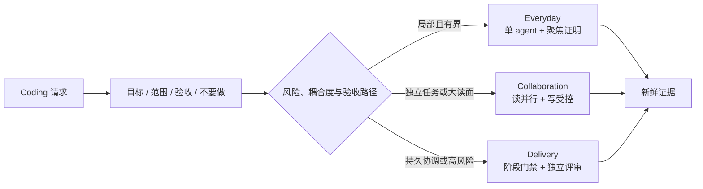

<div align="center">

# ⚡ HappyCoding Everyday

### 一个会按风险自动调整严谨度的 Codex 编码流程。

你只需要描述一次目标。HappyCoding 会在外科手术式小改、有限协作和证据门禁交付之间，自动选择最轻且安全的路径。

[English](README.md) · [简体中文](README.zh-CN.md) · [日本語](README.ja.md) · [한국어](README.ko.md) · [Español](README.es.md)

[](#项目状态)
[](https://github.com/caredhieacid/jensenmo-happy_coding_everyday/actions/workflows/validate.yml)
[](skills/jensenmo-happy-coding-everyday/SKILL.md)
[](.codex-plugin/plugin.json)
[](LICENSE)

[快速开始](#快速开始) · [工作原理](#工作原理) · [设计哲学](docs/design-philosophy.md) · [参与贡献](CONTRIBUTING.md)

</div>

> 英文 [README.md](README.md) 是规范源；本翻译帮助中文开发者浏览，若内容不同步，以英文版为准。

## 这是什么？

HappyCoding Everyday 是 Codex 的单一自动 coding 流程入口。它会把自然语言请求压缩成一个小合同，选择最低充分执行通道，完成工作，并用最终修改后的新鲜证据收口。你不需要自己选模式、提醒测试，或管理一队 agent。

它同时优化两件事：

- 日常任务尽量轻；
- 失败代价上升时，门禁同步增强。

## 快速开始

### 作为 Codex plugin 安装

```bash
codex plugin marketplace add caredhieacid/jensenmo-happy_coding_everyday
```

在 Codex 中打开 **Plugins**，选择 **JensenMo HappyCoding**，安装 **HappyCoding Everyday**。新建任务后直接说需求：

```text
修复登录回归，保留我未提交的其他改动，完成后给我新鲜验证证据。
```

也可以显式调用：

```text
$jensenmo-happy-coding-everyday 先审计这个 API 合同，不要修改代码。
```

直接安装 skill、更新、卸载和兼容性说明见 [快速入门](docs/getting-started.md)。

## 为什么做这个项目？

优秀的 coding 工作流往往擅长规划、TDD、review、编排或交付。如果多个工作流同时作为“总入口”，很容易产生重复计划、重复评审、上下文压力，以及比任务本身更贵的流程。

HappyCoding 只保留一个 dispatcher，并在需要时组合 Git、后端、安全、可观测性、浏览器和产品专属规范。这些领域规则依然重要，但不再争抢整个 coding 生命周期。

## 工作原理



| 通道 | 何时使用 | 默认行为 | 示例 |
| --- | --- | --- | --- |
| **Everyday** | 单一有界目标、低耦合、一个验收路径 | 检查、最小改动、聚焦验证 | 修复解析器回归并提交普通 PR |
| **Collaboration** | 工作可独立拆分，或读面会挤压主上下文 | 有限并行研究，共享写入保持单线 | 同时调查互不相关的登录 401 和 CSV 列序问题 |
| **Delivery** | 安全、迁移、生产、持久协调或分阶段真路径验收让失败变贵 | 持久合同、阶段门禁、独立 review、回滚思维 | 跨存储、鉴权、前端和发布交付多租户隔离 |

升级是可逆的。调查证明问题局部后，可以降回 Everyday。仅仅出现 PR、多个文件或前后端，不会自动触发 Delivery。

## 核心原则

1. **意图只说一次**：由入口判断流程，不让用户选模式。
2. **最低充分严谨度**：默认 Everyday，只有证据出现才升级。
3. **证据胜过仪式**：验证必须证明行为，而不是只证明命令执行过。
4. **读并行、写受控**：保护主上下文，同时避免合并混乱。
5. **新鲜验证**：最终改动后重新运行相关证明。
6. **可逆升级**：任务不再需要时，撤掉额外流程。
7. **仓库规则优先**：项目本地约定和更严格安全边界依然生效。
8. **只读就是只读**：审计、解释和诊断不等于授权修改。

更多内容见 [设计哲学](docs/design-philosophy.md) 和 [架构决策](docs/architecture.md)。

## 它刻意不做什么

- 不创建新的 agent runtime 或框架；
- 不强制多 agent；
- 不要求每个小改都写计划文档、跑完整 TDD 或全量测试；
- 不替代领域工程标准；
- 不把自主执行解释为部署、删除、迁移或强推授权；
- 不用 agent 数量、文档数量或工具调用次数衡量成功。

## 直接安装 skill

```bash
git clone https://github.com/caredhieacid/jensenmo-happy_coding_everyday.git
cd jensenmo-happy_coding_everyday
mkdir -p "$HOME/.agents/skills"
ln -s "$(pwd)/skills/jensenmo-happy-coding-everyday" \
  "$HOME/.agents/skills/jensenmo-happy-coding-everyday"
```

Codex 支持软链接 skill。若目标已存在，先检查再替换。旧的 `~/.codex/skills` 可能仍兼容，但 `$HOME/.agents/skills` 是当前官方文档中的用户级路径。

## 验证与发布

- **结构检查**：验证 skill 元数据、plugin 包、本地链接、翻译和场景 schema；
- **行为评估**：在全新 agent 上下文运行真实提示词，并逐条检查可观察不变量；
- **真实任务证据**：只有实际环境中的验证，才能证明某次代码变更正确。

```bash
python3 -m unittest discover -s tests -p 'test_*.py'
python3 scripts/validate_repository.py
```

每个 PR 都会生成确定性的 plugin 预览包。与 plugin 版本一致的 `v*` tag 会自动创建 GitHub Release，并附带 SHA-256 校验文件。

## 设计参考

我们参考了 [OpenAI Plugins](https://github.com/openai/plugins) 当前的 Codex plugin 分发结构、[Anthropic Skills](https://github.com/anthropics/skills) 的自包含 skill 结构、[Superpowers](https://github.com/obra/superpowers) 的行为验证、[GitHub Spec Kit](https://github.com/github/spec-kit) 的意图中心文档，以及 [Awesome Copilot](https://github.com/github/awesome-copilot) 的公共仓库导航。

HappyCoding 不复制这些项目的工作流文本，也不把它们作为运行依赖。详细取舍见 [设计哲学](docs/design-philosophy.md)。

## 文档

- [文档首页](docs/README.md)
- [快速入门](docs/getting-started.md)
- [架构](docs/architecture.md)
- [设计哲学](docs/design-philosophy.md)
- [行为评估方法](docs/evaluation-methodology.md)
- [路线图](docs/roadmap.md)

## 项目状态

当前为 **Alpha**：核心路由、plugin 包、结构检查和初始压力场景已经存在；升级阈值仍需通过真实 coding 任务持续校准。Alpha 不代表生产部署可以自动放行。

欢迎阅读 [参与贡献](CONTRIBUTING.md)、[安全策略](SECURITY.md)、[支持说明](SUPPORT.md) 和 [行为准则](CODE_OF_CONDUCT.md)。

## 许可证

[MIT](LICENSE) © 2026 Jensen Mo
